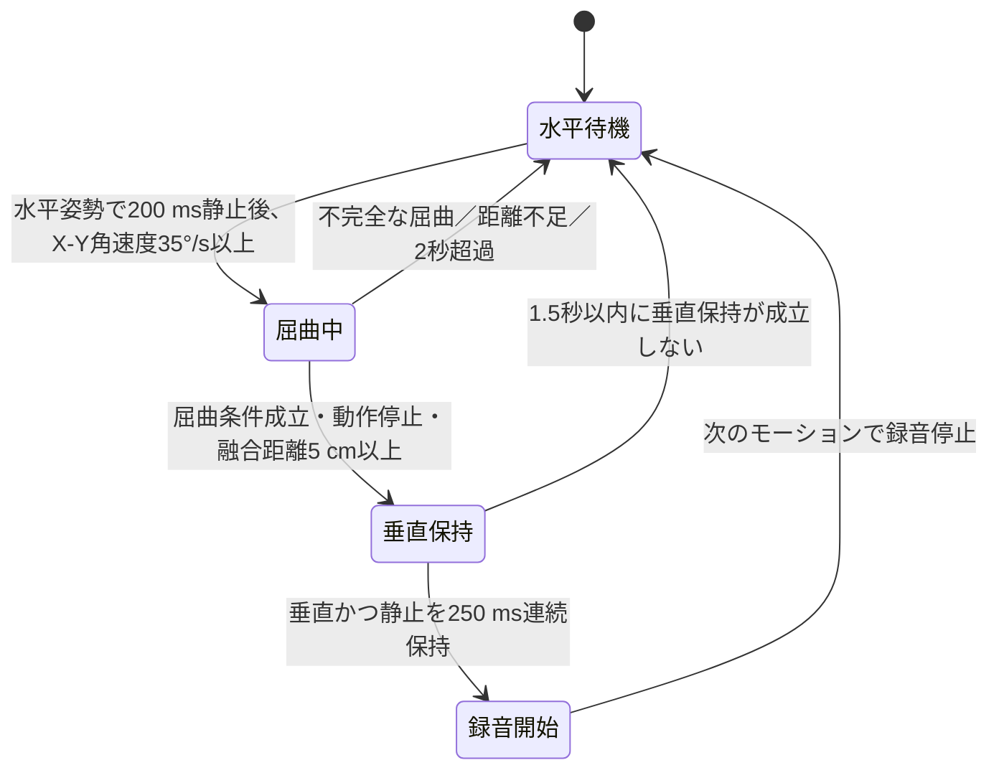

# 水平開始→肘屈曲→垂直静止ジェスチャー仕様

対象デバイス: Seeed Studio XIAO nRF52840 Sense<br>
対象ファームウェア: HarnessNode `0.0.20` 以降

## 発動条件

- XIAO nRF52840 Senseをリストバンドの前腕・手首の内側（掌側）に置く
- 部品面を皮膚側へ向ける。基板の面内方向は条件にしない
- 手のひらの面を水平にして200 ms以上静止する
- 静止成立後1秒以内に肘関節の屈曲を開始する
- 屈曲はX-Y合成角60°以上、ピーク角速度50°/s以上、動的加速度0.5 m/s²以上とする
- 屈曲中の加速度・ジャイロ融合推定移動距離を5 cm以上とする
- 屈曲後、手・前腕を垂直位置に留める
- 垂直かつ静止した状態が250 ms連続した時点で録音を開始する
- 回内・回外の角度、方向、速度は条件にしない

手のひらが上向きか下向きか、右手か左手かでは加速度軸の符号が変わるため、
姿勢判定には軸成分の絶対値を使う。

## 装着条件とセンサー軸

基板上の軸は次のように扱う。

| 軸 | XIAO基板上の方向 | 新しい判定での役割 |
|---|---|---|
| `X` | 基板長手方向、USB端子から離れる方向 | 掌面内の軸。屈曲回転と終了姿勢の合成判定 |
| `Y` | 基板横方向 | 掌面内の軸。屈曲回転と終了姿勢の合成判定 |
| `Z` | 部品面から外向き | 掌面の法線。開始時の水平判定 |

根拠資料:

- [Seeed Studio XIAO nRF52840 Series Wiki](https://wiki.seeedstudio.com/XIAO_BLE/)
- [Seeed Studio XIAO nRF52840 Sense IMU Usage](https://wiki.seeedstudio.com/XIAO-BLE-Sense-IMU-Usage/)
- [ST LSM6DS3TR-C datasheet](https://www.st.com/resource/en/datasheet/lsm6ds3tr-c.pdf)
- [Zephyr Sensor API](https://docs.zephyrproject.org/latest/doxygen/html/group__sensor__interface.html)

以前の仕様は基板が手首の背側にある前提だった。`0.0.20`以降は基板が掌側にあり、
部品面が皮膚側を向く前提で姿勢軸を評価する。

## 姿勢判定

静止時の加速度合成値を `|a|` とし、重力方向に対する軸投影比を求める。

```text
z_ratio = abs(accel_z) / |a|
plane_ratio = sqrt(accel_x^2 + accel_y^2) / |a|
```

開始時の手のひら水平姿勢は次で判定する。

```text
z_ratio >= 0.80
```

終了時の手・前腕垂直姿勢は次の両方で判定する。

```text
plane_ratio >= 0.80
z_ratio <= 0.45
```

`0.80`は重力軸から約37°以内、`0.45`は水平面から約27°以内に相当する。
X-Y合成を使うため、基板が掌面内で回転していても判定は変わらない。

## 状態遷移



### 1. 水平開始姿勢

3軸合成角速度19°/s以下、`z_ratio >= 0.80`を
200 ms以上連続して満たすと屈曲開始を受け付ける。受付期間は1秒である。
水平でない静止姿勢から直接動かしても候補を開始しない。

起動時のジャイロバイアスは、加速度ベクトル差0.8 m/s²以下かつ生ジャイロ差
5°/s以下の25サンプル連続区間から求める。待機中にも20サンプルの安定区間で
8°/s以上のずれを検出すると自動再校正する。

### 2. 肘屈曲と5 cm移動

掌面内X-Y軸の合成角速度を使う。基板の面内方向は固定しない。

```text
palm_plane_rate = sqrt(gyro_x^2 + gyro_y^2)
flex_angle = sqrt(integral(gyro_x)^2 + integral(gyro_y)^2)
```

屈曲候補には次の条件をすべて要求する。

- 開始角速度: 35°/s以上
- 継続時間: 180〜2000 ms
- X-Y合成屈曲角: 60°以上
- X-Yピーク角速度: 50°/s以上
- 加速度エビデンス: 0.5 m/s²以上

水平から垂直への公称姿勢変化は約90°である。屈曲角の下限は、装着角度と人体差を
許容するため60°とする。終了姿勢は別途、加速度の重力投影で確認する。

距離推定は、ジャイロ積分姿勢で加速度を屈曲開始座標へ戻し、時定数0.55秒の
低周波ベースラインを差し引いて積分する。開始・終了速度をゼロとする補正後の
加速度変位と、有効腕長15 cm・屈曲角から求めた円弧距離の調和平均を
`fused_distance` とし、5 cm以上を要求する。

### 3. 垂直静止と発動

屈曲終了後、次を連続250 ms満たすと直ちに録音を開始する。

- `plane_ratio >= 0.80`
- `z_ratio <= 0.45`
- 3軸合成角速度19°/s以下
- 低周波除去後の線形加速度1.2 m/s²以下

垂直姿勢を一瞬通過するだけでは発動しない。屈曲終了から1.5秒以内に250 ms連続
保持できなければ候補を破棄する。旧仕様の「屈曲後0.5〜5秒待って回内する」状態と
回内・回外のX軸積分は存在しない。

## 閾値一覧

| 項目 | 値 |
|---|---:|
| 開始姿勢のZ重力投影比 | 0.80以上 |
| 開始前静止角速度 | 19°/s以下 |
| 開始前静止時間 | 200 ms |
| 屈曲開始受付期間 | 1000 ms |
| 屈曲開始角速度 | 35°/s以上 |
| 屈曲成立角 | 60°以上 |
| 屈曲ピーク角速度 | 50°/s以上 |
| 屈曲加速度エビデンス | 0.5 m/s²以上 |
| 屈曲時間 | 180〜2000 ms |
| 融合推定距離 | 5 cm以上 |
| 距離推定の有効腕長 | 15 cm |
| 終了姿勢のX-Y面重力投影比 | 0.80以上 |
| 終了姿勢のZ重力投影比 | 0.45以下 |
| 垂直保持中の角速度 | 19°/s以下 |
| 垂直保持中の線形加速度 | 1.2 m/s²以下 |
| 垂直連続保持時間 | 250 ms |
| 垂直保持成立期限 | 屈曲終了から1500 ms |

定数の正本は `nordic-main/src/main.c` の `GESTURE_*` 定義である。

## BLE検証

`mac_client/gesture_validator.py` は、macOSのBluetoothを通じて診断イベントと
`recording_start`を受信する。各試行はカウントダウン後のPing音と `GO` 表示を
開始合図とする。単一動作試行では、GO後から発動までに `reset` があれば、後続動作で
発動してもその試行をFAILとする。

画面には各試行の終了後、水平な開始姿勢、開始前の静止、肘屈曲、5 cm以上の移動、
垂直な終了姿勢、垂直位置での静止保持、途中リセットの有無、最終発動を `[OK]`、
`[NG]`、`[--]`（前段階が未成立で未判定）で表示する。個々のBLEイベントや診断の
生ログは画面に表示せず、`--json-output`で指定したJSONレポートだけに保存する。

```bash
cd mac_client
venv/bin/python gesture_validator.py --trials 1 \
  --json-output /private/tmp/harness-node-horizontal-vertical.json
```

診断イベント `0x30` の値は次のとおり。

| stage | 表示名 | 値 |
|---:|---|---|
| `0x01` | `flex_start` | X-Y角速度、開始Z投影比、動的加速度 |
| `0x02` | `flex_complete` | 屈曲角、ピーク角速度、加速度エビデンス |
| `0x03` | `vertical_hold_start` | X-Y面投影比、Z投影比、線形加速度 |
| `0x04` | `match` | 融合距離cm、X-Y面投影比、垂直保持ms |
| `0x05` | `distance_ready` | 融合距離cm、加速度距離cm、円弧距離cm |
| `0x06` | `vertical_ready` | X-Y面投影比、Z投影比、垂直保持ms |
| `0x07` | `gyro_bias_ready` | バイアス補正量、X-Y面バイアス、Zバイアス |
| `0x10` | `wait_reject` | 却下理由と姿勢・角速度 |
| `0x80` | `reset` | リセット理由と判定時の測定値 |

主なリセット理由は `flex_timeout`、`incomplete_flex`、`distance_too_short`、
`endpoint_not_vertical`、`vertical_hold_timeout` である。

## 実機テスト手順

1. XIAOをリストバンドの掌側へ移し、部品面を皮膚側へ向ける
2. USBケーブルを外し、BLE接続できる状態にする
3. 手のひらを水平にして静止する
4. Ping音の後、肘を屈曲して手を持ち上げる
5. 手・前腕が垂直になった位置で止め、発動までそのまま保持する
6. 診断の屈曲角、融合距離、X-Y面/Z投影比、保持時間を記録する

物理テストは1回ずつ実行し、各回の開始前にユーザーへ動作、回数、Ping音を説明して
準備確認を取る。

### 2026-08-15 軸条件の実機補正

`0.0.19`の初回試行では開始姿勢がZ比0.90で水平だった一方、垂直停止時の加速度は
X=2.76、Y=-9.34、Z=0.28 m/s²となり、重力がXではなくY軸へ移った。基板の面内
方向を前腕へ固定する前提が実装と実装着で一致していなかったため、`0.0.20`では
屈曲をX-Y角速度・角度の合成、終了姿勢をX-Y重力投影の合成で判定する。

同じ試行で動作開始直前の角速度15.2°/sも観測したため、開始静止上限は12°/sから
19°/sへ変更した。屈曲開始には引き続き35°/s以上を要求する。

### 2026-08-15 `0.0.20` 実機確認

掌側装着で1試行し、BLE検証はPASSした。開始Z比0.91、屈曲角98.6°、融合距離
27.5 cm、終了時のX-Y面重力比1.00、Z比0.05、垂直保持262 msを観測し、
`recording_start`を受信した。垂直保持開始直後に角速度10.0°/sで一度保持が途切れたが、
15 ms後に再び保持へ入り、シーケンス全体のリセットなしで成立した。

## ビルドとOTA更新

```bash
cd nordic-main
./build_and_package_ota.sh

cd ../mac_client
venv/bin/python ota_updater.py --device HarnessNode ../nordic-main/ota_update.bin
```

USB書き込みは行わない。更新後、`0.0.20`がslot 0で`active`かつ`confirmed`に
なったことまで確認する。

## 制約

- 手首の単一IMUだけでは肘関節そのものの角度を直接測れないため、X-Y回転、移動距離、
  開始・終了姿勢を組み合わせて肘屈曲を近似する
- 絶対姿勢を重力投影で判定するため、強い加減速や旋回中は姿勢判定が一時的にずれる
  可能性がある
- 右手・左手と掌の上向き・下向きを区別しないため、軸投影の符号は条件に使わない
- 単一IMUによる5 cmは実測距離ではなく、加速度と円弧距離の融合推定値である
