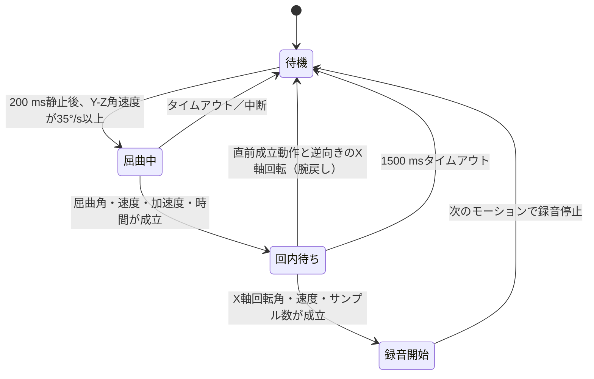

# 屈曲→回内ジェスチャー仕様（XIAO nRF52840 Sense）

対象ファームウェア: HarnessNode `0.0.11` 以降

## 目的

Seeed Studio XIAO nRF52840 Sense をリストバンドに取り付け、次の一連の動作で
HarnessNode の録音を開始する。

1. 肘を伸展した状態で短時間静止する
2. 肘を屈曲する
3. 続けて前腕・手関節を回内する

判定には LSM6DS3TR-C の加速度センサーとジャイロを併用する。静止時の重力が
特定の軸を向くことは条件にしないため、立位、臥位、走行中の車内で同じ判定を
使用する。ジャイロ角度は符号付きで積分し、成立判定では絶対値を使うため、
右手・左手のどちらに装着しても動作する。

実装は `nordic-main/src/main.c` の `process_gesture_sample()` にある。

## 装着条件とセンサー軸

次を装着条件とする。

- USB端子やIMUなどの部品がある基板面を、手首側（内側）へ向ける
- 基板の長手方向を前腕の長手方向へ合わせる
- USB端子側を手先・肘のどちらへ向けるかは成立判定に影響しない

Seeed Studio 公式の基板データにある U3（LSM6DS3TR-C）の配置と、ST公式
データシートのセンサー軸図を照合した軸対応は次のとおり。

| 軸 | XIAO基板上の正方向 | 判定での役割 |
|---|---|---|
| `+X` | 基板長手方向、USB端子から離れる方向 | 前腕長手軸まわりの回内・回外 |
| `+Y` | 基板横方向、5V/GND/3V端子側 | 肘屈曲の横軸成分 |
| `+Z` | 部品面から外向き | 肘屈曲の横軸成分 |

軸対応は、基板上の部品配置から得た推定を含む。根拠資料は次の公式資料。

- [Seeed Studio XIAO nRF52840 Series Wiki](https://wiki.seeedstudio.com/XIAO_BLE/)
- [Seeed Studio XIAO nRF52840 Sense IMU Usage](https://wiki.seeedstudio.com/XIAO-BLE-Sense-IMU-Usage/)
- [ST LSM6DS3TR-C datasheet](https://www.st.com/resource/en/datasheet/lsm6ds3tr-c.pdf) — Figure 1 の軸定義
- [Zephyr Sensor API](https://docs.zephyrproject.org/latest/doxygen/html/group__sensor__interface.html) — ジャイロ値の単位は rad/s

ファームウェアは Zephyr から得たジャイロ値を rad/s から degree/s に変換して
から、起動時に測った3軸バイアスを差し引く。

## 状態遷移



### 1. 開始前の静止

3軸合成角速度が `12°/s` 以下の状態を `200 ms` 以上要求する。この間の加速度
ベクトルをローパス更新し、屈曲開始時の基準値として保存する。静止成立後は
`1000 ms` の開始受付状態を保持する。これにより、角速度が自然に立ち上がる動作や、
手首装着時の軸干渉によってX軸成分が先に観測される動作でも、
12°/sを超えた最初のサンプルがまだ35°/s未満でも屈曲開始を取りこぼさない。
これは肘の絶対角ではなく、「伸展姿勢を作った後に動作を開始する」ための静止
区切りである。

### 2. 肘屈曲

前腕長手軸に直交する角速度を次式で求める。

```text
transverse_rate = sqrt(gyro_y^2 + gyro_z^2)
```

`transverse_rate >= 35°/s` になった時点で屈曲を開始する。YとZの符号付き角度を
個別に積分し、次式の合成角を評価する。X軸成分が同時に大きくても、下記の屈曲角・
ピーク速度・加速度条件が成立する限り候補を維持する。

```text
flex_angle = sqrt(integral(gyro_y)^2 + integral(gyro_z)^2)
```

屈曲成立には次の全条件が必要。

- 継続時間: `180〜1600 ms`
- 合成角: `35°` 以上
- Y-Zピーク角速度: `50°/s` 以上
- 加速度エビデンス: `0.5 m/s²` 以上

加速度エビデンスは、重力1gからの合成加速度偏差と、静止中に保存した開始
ベクトルからの3軸差分のうち大きい値である。これによりジャイロだけの振動・
ドリフトでは成立しにくくする。

実動作では屈曲と回内のセンサー成分が重なるため、開始受付中のX軸成分を最大
`1000 ms` 保存する。屈曲開始後も `50 ms` 以上かつ屈曲角 `8°` 以上になれば
X軸回転を継続積分する。最終的に屈曲35°などの全条件が成立しなければ発動しない
ため、回内だけの動作は成立しない。

### 3. 回内

屈曲成立後 `1500 ms` 以内を回内受付期間とする。X軸角速度が `20°/s` 以上の
サンプルを積分する。正方向角と負方向角は別々に積算し、大きい側を採用するため、
動作途中の小さな揺り戻しで有効な回内角が相殺されない。

次の全条件がそろうと録音開始を要求する。

- X軸積分角の絶対値: `30°` 以上
- X軸ピーク角速度: `55°/s` 以上
- 有効サンプル数: `3` 以上
- 屈曲開始からの全所要時間: `3000 ms` 以下

成立後の `1200 ms` 抑止は同一動作内の重複だけを防ぐ短いガードとして維持する。
腕を開始姿勢へ戻す動作は長い禁止時間では抑止せず、直前の成立動作から `6000 ms`
以内にX軸回転方向が反転した候補を1回だけ `return_motion` として破棄する。同じ
X軸方向の次ジェスチャーは禁止されない。

## 姿勢・左右・車内振動への対応

| 要求 | 対応方法 |
|---|---|
| 立位／臥位 | 重力がX/Y/Zのどれを向くかを判定条件にしない |
| 右手／左手 | 屈曲はY-Z合成角、回内は符号付きX角の絶対値で判定 |
| USB端子の前後 | X軸の符号が反転しても絶対値判定なので成立 |
| 走行中の車内 | 開始前静止、最小角度、ピーク速度、動的加速度をすべて要求 |

車内対応は通常の走行振動を除外するための設計であり、急旋回や衝撃を含むすべて
の車両運動で誤発動しないことを保証するものではない。実車での閾値評価は下記の
テスト項目に沿って行う。

## センサー設定と閾値一覧

| 項目 | 値 |
|---|---:|
| 加速度ODR | 416 Hz |
| ジャイロODR | 104 Hz |
| ジャイロ測定レンジ | ±500°/s |
| 通常時ポーリング | 25 ms |
| ライトスリープ時ポーリング | 50 ms |
| 起動時バイアス計測 | 25サンプル |
| 静止角速度 | 12°/s以下 |
| 静止保持時間 | 200 ms |
| 静止成立後の開始受付 | 1000 ms |
| 屈曲開始角速度 | 35°/s以上 |
| 屈曲成立角 | 35°以上 |
| 屈曲ピーク角速度 | 50°/s以上 |
| 屈曲加速度エビデンス | 0.5 m/s²以上 |
| 屈曲時間 | 180〜1600 ms |
| 回内積分開始角速度 | 20°/s以上 |
| 屈曲前のX軸先行成分 | 開始受付中、最大1000 ms保持 |
| 屈曲中の回内先行積分 | 屈曲開始50 ms後かつ屈曲角8°以上 |
| 回内成立角 | 30°以上 |
| 回内ピーク角速度 | 55°/s以上 |
| 回内受付期間 | 屈曲成立後1500 ms |
| 全シーケンスタイムアウト | 3000 ms |
| 同一動作の重複抑止 | 1200 ms |
| 腕戻し方向シグネチャ有効期間 | 6000 ms |

定数の正本は `nordic-main/src/main.c` の `GESTURE_*` 定義であり、閾値を変更した
場合はこの表も同時に更新する。

## 既知の制約

### 肘の絶対伸展角

手首にある単一IMUだけでは、前腕と上腕の相対角を直接測れない。このため、
「肘が伸展していること」そのものではなく、開始前の200 ms静止と、その後の
十分なY-Z回転を使って伸展→屈曲を近似する。肘角を厳密に要求する場合は、
上腕側に2個目のIMUを追加する必要がある。

### 回内と回外

左右設定なしで両手に対応するため、最初のX軸回転は正負の両方向を許容している。
したがって、現仕様では十分に大きい回外も回内と同様に成立し得る。左右どちらの
手かを外部情報なしで判別し、同時に任意の全身姿勢で回内だけを選ぶことは、
単一の6軸IMUでは一意に決められない。回内方向だけに制限する場合は、装着する手
または許可するX軸符号を設定値として追加する。ただし成立直後の腕戻しについては、
直前の成立方向に対する相対的なX軸反転として除外する。

## 実機検証

起動後、USB CDCログで次のメッセージを確認できる。

```text
>>> Gesture flex start: ...
>>> Gesture flex complete: ...
>>> Gesture MATCH: flex then pronation ...
```

最低限、次のマトリクスを各10回ずつ試し、成立回数と誤発動を記録する。

| 条件 | 正しい屈曲→回内 | 屈曲のみ | 回内のみ | 回内→屈曲 | 通常動作5分 |
|---|---:|---:|---:|---:|---:|
| 立位・右手 | 10 | 10 | 10 | 10 | 1 |
| 立位・左手 | 10 | 10 | 10 | 10 | 1 |
| 臥位・右手 | 10 | 10 | 10 | 10 | 1 |
| 臥位・左手 | 10 | 10 | 10 | 10 | 1 |
| 走行中・右手 | 10 | 10 | 10 | 10 | 1 |
| 走行中・左手 | 10 | 10 | 10 | 10 | 1 |

期待結果は、正しい動作では録音開始、それ以外では録音開始しないこと。走行試験は
運転者ではなく同乗者が操作・記録し、安全を優先する。

### BLE対話検証スクリプト

`mac_client/gesture_validator.py` は HarnessNode にBLE接続し、各試行で
`recording_start` (`0x01`) が届いたかをPASS/FAIL判定する。成立後はBLE停止
コマンドを送るため、複数試行を続けて実行できる。試行前にはBLEコマンドによる
開始・停止イベントの往復preflightを行い、通知経路の問題とジェスチャー不成立を
区別する。各試行の開始時にはmacOSの `afplay` で `Ping.aiff` を再生するため、
画面を見ずにMacのスピーカー音を開始合図として使える。

```bash
cd mac_client
venv/bin/python gesture_validator.py --trials 3
```

誤発動しないことを確認する試験では、期待値と指示を指定する。

```bash
venv/bin/python gesture_validator.py \
  --expect no-match \
  --trials 3 \
  --instruction "回内だけを行ってください"
```

主なオプション:

| オプション | 説明 |
|---|---|
| `--trials N` | 試行回数。既定値は3 |
| `--countdown N` | Ping再生までの秒数。既定値は3 |
| `--window N` | GO後にイベントを待つ秒数。既定値は7 |
| `--expect match` | 正しい動作が成立することを検証 |
| `--expect no-match` | 非対象動作で成立しないことを検証 |
| `--json-output PATH` | 試行結果をJSONでも保存 |
| `--cue-sound PATH` | Pingの代わりに再生する音声ファイル |
| `--no-cue-sound` | 開始合図音を無効化 |
| `--skip-preflight` | BLEイベント経路の事前往復確認を省略 |
| `--self-test` | BLEを使わずパケット解析を自己テスト |

重要な進捗は `CODEX_CONNECTED`、`CODEX_TRIAL`、`CODEX_SUMMARY` の一行形式
でも出力する。macOSではBluetooth権限を持つTerminalから実行し、CodexはTerminal
の出力を読み取ってユーザーへGO、PASS/FAIL、次の試行を案内できる。検証中は
スクリプトが一時的にBLE primary接続を引き受け、終了時に他の接続へ返す。

### USBなしのBLE内部診断

HarnessNode `0.0.7` 以降は、ジェスチャー判定の内部状態をイベント `0x30` で
primary接続へ通知する。USBシリアルケーブルを装着できない実動作でも、検証
スクリプトが診断を表示し、`--json-output` の各試行とトップレベル
`diagnostics`（カウントダウン中を含む全診断）へ保存する。

```text
[0x00][0x55][0x30][stage][reason][value1 f32][value2 f32][value3 f32]
```

| stage | 表示名 | 値 |
|---:|---|---|
| `0x01` | `flex_start` | Y-Z角速度、X角速度、動的加速度 |
| `0x02` | `flex_complete` | 屈曲角、ピーク角速度、加速度エビデンス |
| `0x03` | `pronation_start` | X角速度、Y-Z角速度、初回積分角 |
| `0x04` | `match` | 回内角、ピーク角速度、有効サンプル数 |
| `0x10` | `wait_reject` | 却下理由、Y-Z角速度、X角速度、合成角速度 |
| `0x80` | `reset` | リセット理由と、その時点の角度・速度・加速度等 |

主な理由は `quiet_not_ready`、`axis_not_transverse`、`flex_rate_low`、
`flex_timeout`、`incomplete_flex`、`pronation_timeout`、`return_motion`。
`return_motion` の値はX方向の関係（`-1`）、現在のX角、直前成立からの経過ms。
重要な診断は
`CODEX_DIAG` 行にも出力される。

### 2026-08-11 実機調整結果

同一ユーザー・同一装着状態で、各回のPing後に自然な屈曲→回内を実施した。

| ファームウェア | スクリプト結果 | 観測と変更 |
|---|---:|---|
| `0.0.7` | 4/10 | X軸成分の先行と、回内積分の相殺で取りこぼし |
| `0.0.8` | 6/10 | Ping後に実施できた6回は6/6認識。4回は腕戻しで次試行を先取り |
| `0.0.9` | 9/10 | Ping後の9回は9/9認識。5秒の全面抑止でも腕戻しが1回残存 |
| `0.0.11` | **10/10** | Ping前発動0回。腕戻しを逆向きXの `return_motion` として除外 |

`0.0.9` の長い全面抑止は採用せず、`0.0.11` では元の1200 ms重複ガードと
方向シグネチャ方式を使用する。

## ビルドと書き込み

NCS v2.9.2 の環境で次を実行する。

```bash
cd nordic-main
./build_and_flash.sh
```

スクリプトが待機を開始したらXIAOのRESETボタンを素早く2回押す。
`XIAO-SENSE`ドライブへmerged UF2がコピーされ、再起動後に
`/dev/cu.usbmodem*` が再列挙されれば書き込み完了である。
