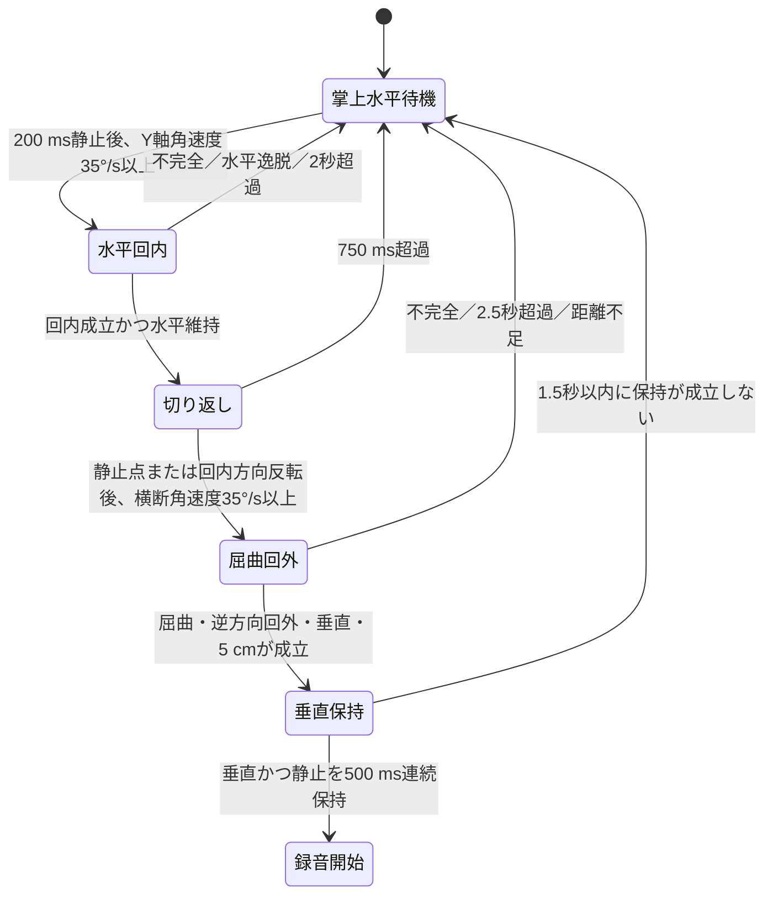

# 水平回内→屈曲・回外→垂直静止ジェスチャー仕様

対象デバイス: Seeed Studio XIAO nRF52840 Sense<br>
対象ファームウェア: HarnessNode `0.0.22` 以降

## 発動条件

- XIAOをリストバンドの手首・前腕の内側（掌側）へ置く
- 部品面を皮膚側にし、基板X軸を前腕と直交、Y軸を前腕に沿わせる
- 手のひらを上向き水平にし、200 ms以上静止する（水平はおおむね±10°）
- 静止成立後1秒以内に、前腕を水平±10°に保ったまま回内する
- 750 ms以内に切り返し、肘を屈曲しながら往路と逆方向へ回外する
- 復路の融合推定移動距離を5 cm以上とする
- 手・前腕を地面に対して垂直から20°以内にする
- 最終姿勢で500 ms連続静止すると録音を開始する

往路と復路のY軸回転方向は相対比較する。このため、右手・左手および
USB端子の向きが逆の装着でも、同じ「回内してから回外する」順序を認識できる。

## 装着条件とセンサー軸

| 軸 | XIAO基板上の方向 | 判定での役割 |
|---|---|---|
| `X` | 基板長手方向、USB端子から離れる方向 | 前腕を横切る方向。復路の肘屈曲の合成回転 |
| `Y` | 基板横方向、5V/GND/3V側 | 前腕に沿う方向。回内・回外と水平／垂直の重力投影 |
| `Z` | 基板・部品面に垂直 | 手のひら上向き水平の開始姿勢 |

部品面が皮膚側の場合、手のひら上向き水平の静止値は現行装着で`+Z`となる前提で
`GESTURE_PALM_UP_Z_SIGN = +1`を使う。反対ならこの定数だけを`-1`へ変更する。

軸の根拠資料:

- [Seeed Studio XIAO nRF52840 Series Wiki](https://wiki.seeedstudio.com/XIAO_BLE/)
- [Seeed Studio XIAO nRF52840 Sense IMU Usage](https://wiki.seeedstudio.com/XIAO-BLE-Sense-IMU-Usage/)
- [ST LSM6DS3TR-C datasheet](https://www.st.com/resource/en/datasheet/lsm6ds3tr-c.pdf)

## 姿勢と回転の判定

加速度合成値を`|a|`として符号付き重力投影比を求める。

```text
y_ratio = accel_y / |a|
z_ratio = accel_z / |a|
palm_up_z_ratio = z_ratio * GESTURE_PALM_UP_Z_SIGN
```

開始姿勢は次の両方を要求する（水平±10°相当）。

```text
palm_up_z_ratio >= 0.90
abs(y_ratio) <= 0.17   // ~sin(10°)
```

基板Y軸がおおむね前腕軸なので、回内・回外は`gyro_y`を積分する。復路の肘屈曲は
Y軸を除いた合成回転で近似する。

```text
transverse_rate = sqrt(gyro_x^2 + gyro_z^2)
transverse_angle = sqrt(integral(gyro_x)^2 + integral(gyro_z)^2)
roll_angle = integral(gyro_y)  // abs(gyro_y) >= 20 deg/sだけを積分
```

往路中は前腕水平を維持する。

```text
abs(y_ratio) <= 0.17
```

終了姿勢は垂直到達で判定する（往路Y符号との反対条件は使わない）。

```text
abs(y_ratio) >= 0.94   // 垂直から約20°以内
```

## 状態遷移



シーケンス全体は開始から5秒で打ち切る。録音開始後の1200 msは、同じ動作の余韻を
録音停止として扱わないための既存保護であり、ジェスチャー候補間の禁止時間ではない。

### 往路: 水平を維持した回内

次をすべて要求する。

- Y軸角速度による開始: 35°/s以上
- 継続時間: 180〜2000 ms
- Y軸回転積分絶対値: 30°以上
- Y軸ピーク角速度: 55°/s以上
- 往路中の最大`|y_ratio|`: 0.17以下（水平±10°）

開始姿勢が受付済みの期間は、先行するY軸回転も積分する。

### 切り返し

往路成立後、横断角速度とY軸角速度が25°/s以下になるか、Y軸回転方向が反転した点を
切り返しとして認識する。その後750 ms以内に横断角速度35°/s以上で復路を始める。

### 復路: 肘屈曲と回外、5 cm移動

復路にも180 ms以上、横断合成角60°以上、横断ピーク50°/s以上、加速度エビデンス
0.5 m/s²以上を要求する。Y軸積分は絶対値30°以上、ピーク55°/s以上で、往路積分と
逆符号でなければならない。復路は2500 ms以内に完了する。

距離推定は、ジャイロ積分姿勢で加速度を復路開始座標へ戻し、時定数0.55秒の低周波
ベースラインを差し引いて二重積分する。終端速度ゼロ補正後の加速度変位と、有効腕長
15 cm・屈曲角から求めた円弧距離の調和平均を`fused_distance`とし、5 cm以上を要求する。
車の並進加速度は低周波ベースラインと両センサー一致条件によって影響を抑える。

### 最終姿勢と静止

復路成立後、次を500 ms連続して満たすと録音を開始する。

- `abs(y_ratio) >= 0.94`（垂直から20°以内）
- 3軸合成角速度19°/s以下
- 低周波除去後の線形加速度1.2 m/s²以下

保持が中断した場合は500 msを数え直す。復路完了から1500 ms以内、かつシーケンス
開始から5000 ms以内に成立しなければ候補を破棄する。

## しきい値一覧

| 項目 | 値 |
|---|---:|
| 開始時の補正Z投影比 | 0.90以上 |
| 開始時のY投影比絶対値 | 0.17以下（±10°） |
| 開始前静止 | 角速度19°/s以下を200 ms |
| 開始受付期間 | 1000 ms |
| 往路の開始Y軸角速度 | 35°/s以上 |
| 往路中のY投影比絶対値上限 | 0.17 |
| 復路の開始横断角速度 | 35°/s以上 |
| 復路の横断合成角 | 60°以上 |
| 復路の横断ピーク角速度 | 50°/s以上 |
| 復路の加速度エビデンス | 0.5 m/s²以上 |
| 往路・復路の最短時間 | 180 ms |
| 往路／復路の最長時間 | 2000／2500 ms |
| 回内・回外のY軸積分角 | 各30°以上、逆符号 |
| 回内・回外のY軸ピーク角速度 | 各55°/s以上 |
| 切り返し角速度／期限 | 25°/s以下／750 ms |
| 復路の融合推定距離 | 5 cm以上 |
| 最終Y投影比絶対値 | 0.94以上 |
| 最終姿勢許容傾斜 | 垂直から20°以内 |
| 最終静止 | 角速度19°/s以下、線形加速度1.2 m/s²以下 |
| 最終連続保持／成立期限 | 500／1500 ms |
| 全シーケンス期限 | 5000 ms |

定数の正本は`nordic-main/src/main.c`の`GESTURE_*`定義である。

## BLE検証

`mac_client/gesture_validator.py`は、macOSのBluetoothを通じて診断イベントと
`recording_start`を受信する。各試行はカウントダウン後のMacのPing音と`GO`表示を
開始合図とする。画面には各条件の`[OK]`、`[NG]`、`[--]`だけを表示し、生のBLEログは
JSONレポートに保存する。

```bash
cd mac_client
venv/bin/python gesture_validator.py --trials 1 \
  --json-output /private/tmp/harness-node-volar-sequence.json
```

診断イベント`0x30`:

| stage | 表示名 | value1 / value2 / value3 |
|---:|---|---|
| `0x01` | `outbound_start` | 回内開始角速度 / 補正Z比 / 開始Y比 |
| `0x02` | `outbound_ready` | 回内積分角 / 回内ピーク角速度 / 最大\|Y比\| |
| `0x03` | `turnaround_ready` | 切り返し時間ms / Y比 / 合成角速度 |
| `0x04` | `return_start` | 横断開始角速度 / Y角速度 / 往路回内角 |
| `0x05` | `return_ready` | 屈曲角 / 回外積分角 / 加速度エビデンス |
| `0x06` | `distance_ready` | 融合距離cm / 加速度距離cm / 円弧距離cm |
| `0x07` | `final_hold_start` | 最終Y比 / 合成角速度 / 線形加速度 |
| `0x08` | `final_ready` | 最終Y比 / 保持ms / 垂直からの傾斜° |
| `0x09` | `match` | 融合距離cm / 最終Y比 / 保持ms |
| `0x0a` | `gyro_bias_ready` | バイアス補正量 / XY合成バイアス / Zバイアス |
| `0x10` | `wait_reject` | 却下理由と測定値 |
| `0x80` | `reset` | リセット理由と測定値 |

主なreset reason:

| reason | 意味 |
|---|---|
| `horizontal_lost` | 往路中に前腕が水平±10°を超えた |
| `final_y_not_reached` | 復路で垂直到達しなかった |
| `wrong_roll_direction` | 復路の回外が往路回内と逆符号でない |

## 実機テスト

OTA後に正例3回、負例3回を1回ずつ実行する。負例は次を使う。

1. 旧動作: 水平から直接屈曲し、垂直で静止する
2. 水平回内だけを行い、復路を行わない
3. 回内・屈曲は行うが、復路で回外を省く

各試行前に、ユーザーへ動作、回数、Ping音が開始合図であることを説明し、明示的な
準備完了を得てから開始する。解釈や修正が必要な試行は1回ずつ実施する。

## ビルドとOTA

```bash
cd nordic-main
./build_and_package_ota.sh

cd ../mac_client
venv/bin/python ota_updater.py --device HarnessNode ../nordic-main/ota_update.bin
```

USB書き込みは行わない。更新後、`0.0.22`がslot 0で`active`かつ`confirmed`であることを
確認する。

## 制約

- 手首の単一IMUでは肘関節を直接測れないため、横断回転、Y軸回転、重力投影、距離を
  組み合わせた近似である
- 強い車両加減速・旋回は一時的に重力投影をずらす可能性があるが、回内→回外の順序、
  水平維持、500 ms静止を併用して誤発動を抑える
- 5 cmは実測距離ではなく、加速度変位とジャイロ由来円弧距離の融合推定値である
