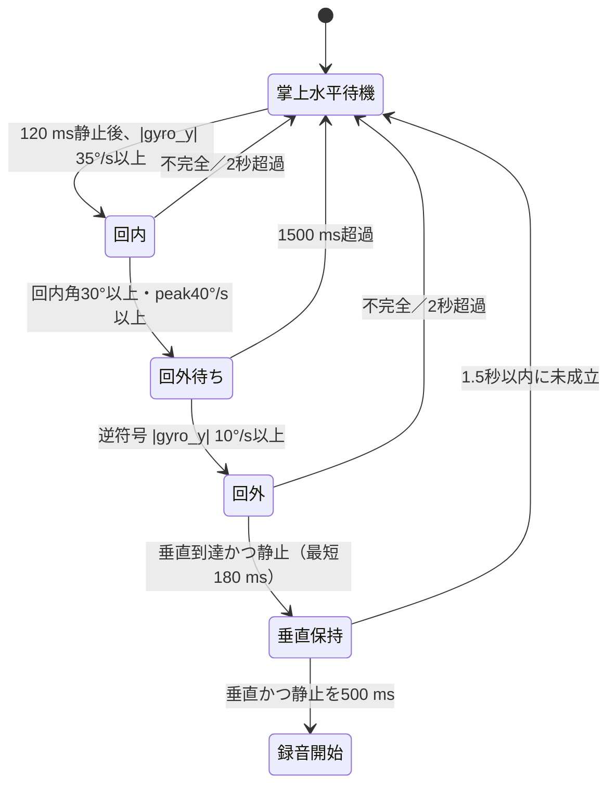

# 回内→直後回外→垂直静止ジェスチャー仕様

対象デバイス: Seeed Studio XIAO nRF52840 Sense
対象ファームウェア: HarnessNode `0.0.33` 以降

## 発動条件

- XIAO をリストバンドの手首・前腕の内側（掌側）へ置く
- 部品面を皮膚側にし、基板 X 軸を前腕と直交、Y 軸を前腕に沿わせる
- 手のひらを上向き水平にし、120 ms 以上静止する（角速度 70°/s 以下）
- 静止成立後 1 秒以内に、前腕軸まわり（`gyro_y`）で回内する
- 回内成立後 1500 ms 以内に、逆符号の `gyro_y`（|gyro_y| ≥ 10°/s）で回外を開始する
- 回外開始後、前腕を地面に対して垂直から約 20°以内にする
- 最終姿勢で 500 ms 連続静止すると録音を開始する

右手・左手および USB 向きの差は、回内と回外の相対符号で吸収する。
肘屈曲角・5 cm 距離・往路の Y 重力維持は要求しない。回外の積分角も不要
（逆符号 `gyro_y` の開始検出のみ）。

## 装着条件とセンサー軸

| 軸 | XIAO 基板上の方向 | 判定での役割 |
|---|---|---|
| `X` | 基板長手方向、USB 端子から離れる方向 | 前腕を横切る |
| `Y` | 基板短い辺に平行（5V/GND/3V 側） | **前腕に沿う＝回内・回外軸**（`gyro_y`） |
| `Z` | 基板・部品面に垂直 | 手のひら上向き水平の開始姿勢 |

部品面が皮膚側の場合、掌上水平の静止値は `GESTURE_PALM_UP_Z_SIGN = +1` 前提。
反対ならこの定数だけを `-1` へ変更する。

## 姿勢と回転の判定

```text
y_ratio = accel_y / |a|
z_ratio = accel_z / |a|
palm_up_z_ratio = z_ratio * GESTURE_PALM_UP_Z_SIGN
roll_angle = integral(gyro_y)  // |gyro_y| >= GESTURE_ROLL_INTEGRATE_RATE_DPS（回内）
```

開始姿勢:

```text
palm_up_z_ratio >= 0.90
abs(y_ratio) <= 0.30
```

最終姿勢（垂直 ±約 20°）:

```text
abs(y_ratio) >= 0.94
```

## 状態遷移



シーケンス全体は開始から 5 秒で打ち切る。録音開始後 1200 ms は再トリガ抑制。

## しきい値一覧

| 項目 | 値 |
|---|---:|
| 開始補正 Z 比 | 0.90 以上 |
| 開始 Y 比絶対値 | 0.30 以下 |
| 開始前静止 | 角速度 70°/s 以下を 120 ms |
| 回内開始 \|gyro_y\| | 35°/s 以上 |
| 回内積分角 | 30° 以上 |
| 回内ピーク | 40°/s 以上 |
| 回外開始 \|gyro_y\| | 10°/s 以上・回内と逆符号 |
| 回外積分角 | **不要** |
| 回外開始期限（回内後） | 1500 ms |
| 回内／回外最長 | 各 2000 ms |
| 最終 Y 比 | 0.94 以上（垂直 ±約 20°） |
| 最終静止 | 角速度 70°/s 以下、線形加速度 3.0 m/s² 以下を 500 ms |
| 全シーケンス期限 | 5000 ms |

定数の正本は `nordic-main/src/main.c` の `GESTURE_*` 定義である。

## BLE 診断（0x30）

| stage | 名前 | value1 / value2 / value3 |
|---:|---|---|
| `0x01` | `outbound_start` | 回内開始角速度 / 補正 Z 比 / 開始 Y 比 |
| `0x02` | `outbound_ready` | 回内積分角 / 回内ピーク / Y 比 |
| `0x03` | `turnaround_ready` | 経過 ms / gyro_y / Y 比 |
| `0x04` | `return_start` | \|gyro_y\| / gyro_y / 往路回内角 |
| `0x05` | `return_ready` | 回外積分（参考） / 回外ピーク（参考） / 最終 Y |
| `0x07` | `final_hold_start` | 最終 Y / 合成角速度 / 線形加速度 |
| `0x08` | `final_ready` | 最終 Y / 保持 ms / 傾き° |
| `0x09` | `match` | 回内角 / 最終 Y / 保持 ms |
| `0x20` | `gyro_y_sample` | gyro_y / Y 比 / 経過 ms（デバッグ時のみ） |
| `0x80` | `reset` | 理由依存 |

## デバッグ: gyro_y 波形

`nordic-main/src/main.c` の `GESTURE_DEBUG_GYRO_Y` が `1` のときのみ、
回内〜回外待ち〜回外中に約 50 ms 間隔で `gyro_y_sample`（stage `0x20`）を送る。

`turnaround_timeout` 時（デバッグ ON）:

| value | 内容 |
|---|---|
| value1 | 経過 ms |
| value2 | 待ち中の最大 **正** gyro_y |
| value3 | 待ち中の最小 **負** gyro_y |

```bash
cd mac_client
venv/bin/python gesture_validator.py --trials 1 \
  --json-output /tmp/gesture-debug.json \
  --gyro-csv /tmp/gyro_y.csv --show-gyro
```

リリースビルドでは `GESTURE_DEBUG_GYRO_Y` は `0`（既定）。波形が必要なときだけ
`1` にしてデバッグ OTA する。

## BLE 検証

```bash
cd mac_client
venv/bin/python gesture_validator.py --trials 1 \
  --json-output /private/tmp/harness-node-volar-sequence.json
venv/bin/python gesture_validator.py --self-test
```

## ビルドと OTA

```bash
cd nordic-main
NRFUTIL=/path/to/nrfutil ./build_and_package_ota.sh

cd ../mac_client
venv/bin/python ota_updater.py --device HarnessNode ../nordic-main/ota_update.bin
```

USB 書き込みは行わない。更新後、`0.0.33` が slot 0 で `active` かつ `confirmed`
であることを確認する。
